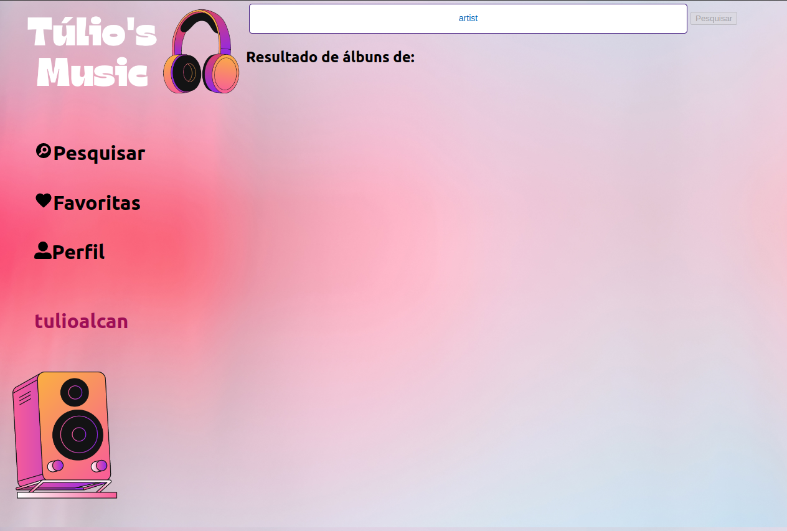
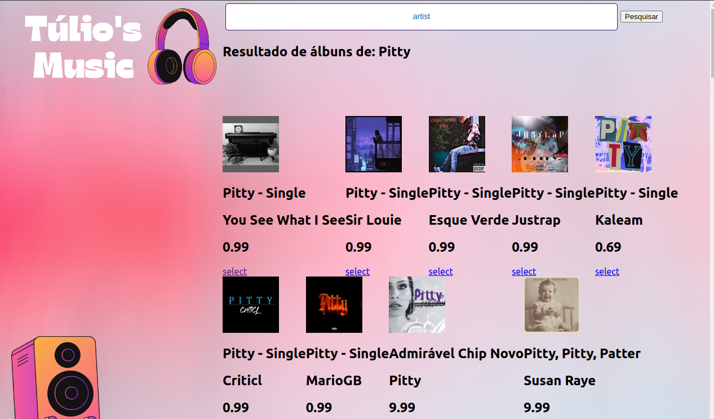
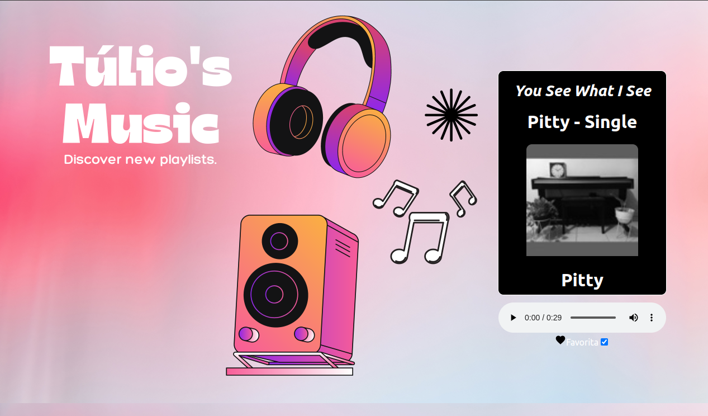

  
<strong>👨‍💻 O que foi desenvolvido</strong>
 

  Projeto criado à parti do projeto TrybeTunes do curso de Desenvolvimento Web da Trybe. Para o projeto foi desenvolvido uma aplicação capaz de reproduzir músicas das mais variadas bandas e artistas, criar uma lista de músicas favoritas e editar o perfil da pessoa usuária logada. Essa aplicação é capaz de:

  - Fazer login;
    
  - Pesquisar por uma banda ou artista;
    
  - Listar os álbuns disponíveis dessa banda ou artista;
  - Visualizar as músicas de um álbum selecionado;
    
  - Reproduzir uma prévia das músicas deste álbum;
  - Favoritar e desfavoritar músicas;
    
  - Ver a lista de músicas favoritas;
  - Ver o perfil da pessoa logada;
  - Editar o perfil da pessoa logada;

  
<strong>:memo: Habilidades Avalidadas pela Trybe</strong>
 

- Fazer requisições e consumir dados vindos de uma `API`;

- Utilizar os ciclos de vida de um componente React;

- Utilizar a função `setState` de forma a garantir que um determinado código só é executado após o estado ser atualizado

- Utilizar o componente `BrowserRouter` corretamente;

- Criar rotas, mapeando o caminho da URL com o componente correspondente, via `Route`;

- Utilizar o `Switch` do `React Router`

- Criar links de navegação na aplicação com o componente `Link`;

